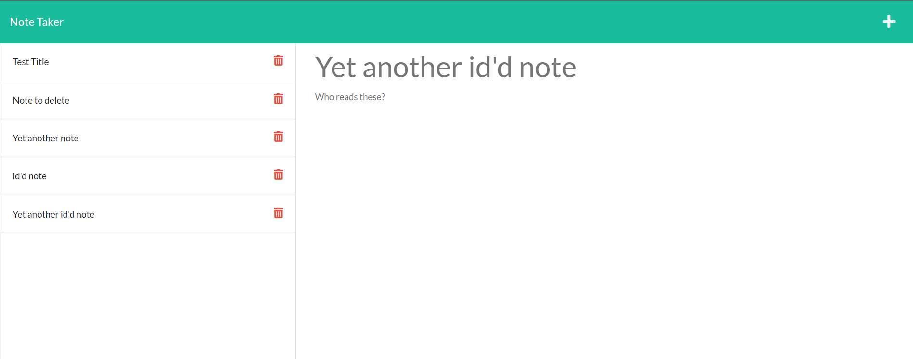

#  Note Taker

## Description:

This website allows the creation of simple notes, which can then be stored, viewed, and deleted for convenience.

## Usage:

To use the application, simply press the 'get started' button, then press the '+' sign to create a new note. You can then input a title and a short note to be saved for later.

If you need to view the contents of the note, simply click on the note to the left. If you wish to delete it, simply click on the trashcan icon to delete it.

## License:

This application is covered under the following license: MIT

- - -

